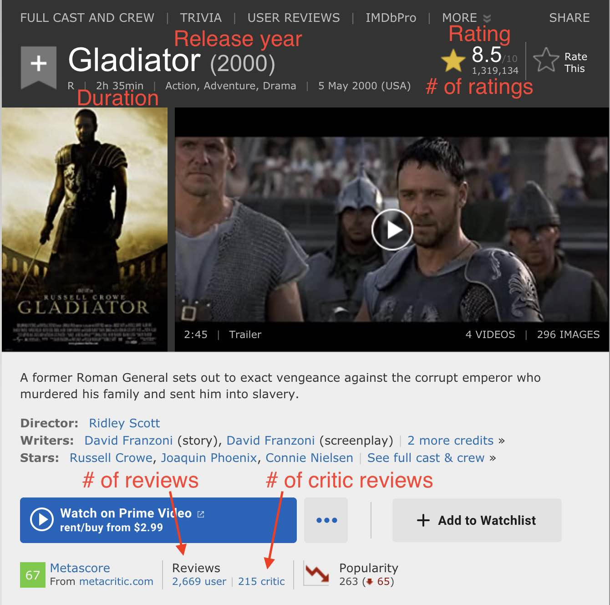

# How to create your own movie dataset?

For this tutorial, you will need to find at least 100 movies at [IMDB](https://www.imdb.com/). You can choose the movies that you have already watched or any other movies that you have not yet watched (or would like to watch). For each movie you will need to note certain features (properties) of the movie (see below for the list of features). You can create a table of all your movies and save in a Google Sheet or a Microsoft Excel file and export a `.csv` file. [Here](./my_imdb.csv) is an example. For neural network training experiments the first column (Movie name) is not needed but you may want to keep it in your original version so you can fix errors if you find any.

  

## Features
1. Duration
1. Release year
1. Number of ratings
1. Number of reviews
1. Number of critic reviews
1. Rating

| Name | Duration | ReleaseYear | NumberOfRatings | NumberOfReviews | NumberOfCriticReviews | Rating |
| --- | --- | --- | --- | --- | --- | --- |
| 1 | 3 | 5 | 7 | 9 | 11 | 13 |

To convert this dataset into a classification problem, you can sort the rows by the last column (i.e., the Rating column) and convert the first half of the numbers to a 0 (zero) and the bottom half to a 1 (one). This way, your output column (rating) will be a binary variable.
